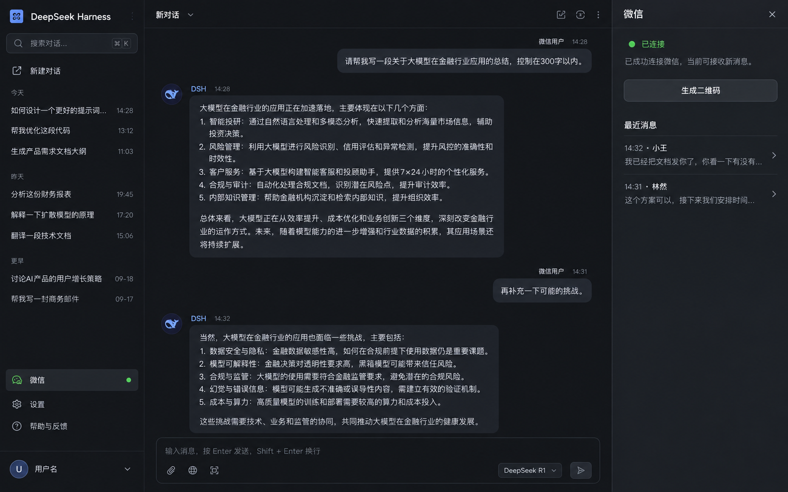

# DSH Weixin Web

为 [DeepSeek Harness](https://github.com/deepseek-ai/deepseek-harness) 提供微信 iLink 通道。插件把微信消息接入独立的 DSH 会话，并在 DSH Web 侧边栏中提供扫码登录、机器人管理和消息列表。



## 功能

- 在 DSH Web 侧边栏提供原生微信管理面板和扫码登录。
- 支持绑定多个微信机器人，并可改名、暂停、恢复、重新登录或解绑。
- 每个微信联系人使用独立的 DSH 会话，并统一归入「微信」工作区。
- 可为每个机器人设置人设、模型和预设。
- 支持文字、图片、多图、文件、视频、语音转写和引用消息。
- 支持主动推送、广播，以及向微信发送图片、视频和文件。
- 自动保存机器人凭据、会话映射、消息预览和接收游标。
- 从 0.1.x 升级时自动迁移旧版机器人和会话数据。

## 安装与使用

需要 Node.js 20.3 或更高版本，以及可以正常运行的 DSH Web profile。

### 安装插件

从 GitHub 安装：

```bash
dsh plugin --profile web add github:agi-redtea/dsh-weixin-web
```

pnpm 10 或更高版本可能会阻止 Git 依赖执行构建脚本。出现 `ERR_PNPM_GIT_DEP_PREPARE_NOT_ALLOWED` 时，可以在 DSH 插件安装界面选择“允许这些脚本并重试”，或者在 Web profile 的 `pnpm-workspace.yaml` 中加入：

```yaml
allowBuilds:
  dsh-weixin-web: true
```

然后重新执行安装命令。

安装完成后启动或重启 DSH：

```bash
dsh web --port 3080
```

### 登录微信

1. 打开 DSH Web。
2. 点击左侧栏的 **微信**。
3. 点击添加机器人并使用手机微信扫码。
4. 登录成功后，微信联系人发送的消息会自动进入对应的 DSH 会话。

### 机器人设置

在微信面板中打开机器人卡片的 **设置**：

- **人设**：为该机器人追加专属系统提示。
- **模型**：指定该机器人的会话使用哪个模型；选择“跟随 DSH 默认”可恢复默认模型。
- **预设**：应用于之后创建的新对话。
- **开始新对话**：为指定联系人新建会话，旧会话仍保留在「微信」工作区。

### 收发媒体

- 收到的图片、文件和视频会作为 DSH 附件交给模型处理。
- 语音使用微信服务端提供的转写文字，不进行本地语音识别。
- 模型可调用 `send_weixin_file` 向当前微信联系人发送图片、视频或文件。
- `push_weixin` 可主动发送文字；指定 `file` 时可以同时发送一个文件。
- 单个媒体默认不超过 20MB。

### 可选配置

在 Web profile 的 `cordis.patch.yml` 中覆盖插件配置：

```yaml
- insert:
    - id: weixin
      name: dsh-weixin-web
      config:
        replyMode: full
        maxChunk: 1500
        maxMediaBytes: 20971520
```

常用配置：

| 配置 | 默认值 | 说明 |
| --- | --- | --- |
| `stateDir` | `$DSH_HOME/dsh-weixin-web` | 凭据和会话状态目录 |
| `cwd` | `stateDir/workspace` | 微信会话工作目录 |
| `replyMode` | `full` | `full` 回发整轮文本；`last` 只回最后一条 |
| `replyTimeoutMs` | `900000` | 单轮回复超时时间，单位为毫秒 |
| `approvalPolicy` | `never` | 微信会话的工具审批策略 |
| `maxChunk` | `1500` | 单条微信消息最大字符数 |
| `sendIntervalMs` | `2000` | 两条发送之间的最小间隔，单位为毫秒 |
| `maxMediaBytes` | `20971520` | 单个媒体文件的大小上限 |

## License

MIT
